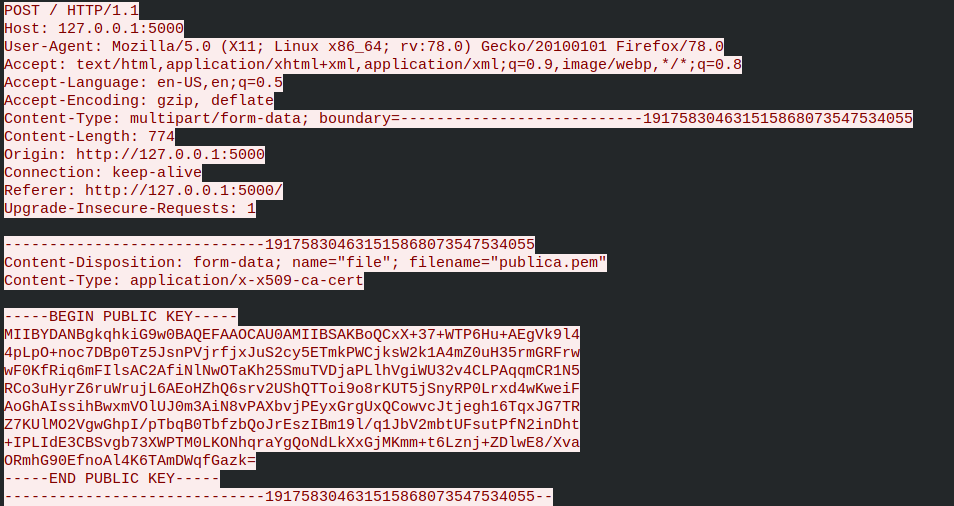
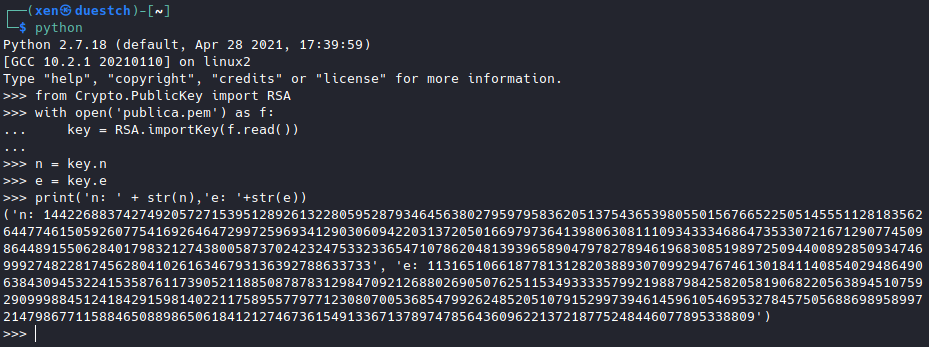
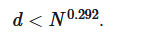
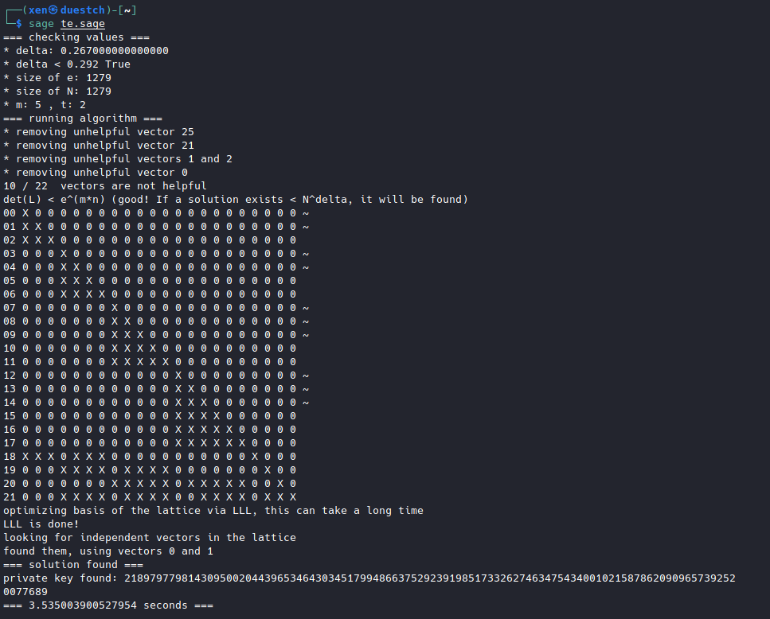
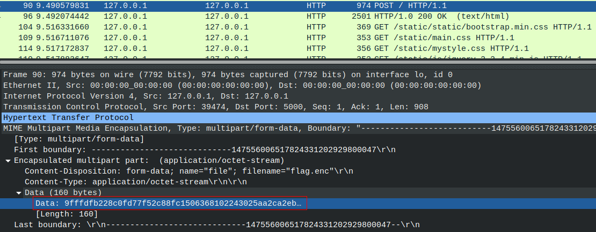

# No-Wiener - HACKDEF5 QUALS

## Contexto

```
Logramos hacer 2 capturas de trafico en texto plano entre un usuario y una app maliciosa, la primera captura tenia solo el texto "0.265-0.267", en la segunda captura detectamos que tiene un certificado y un cifrado, sin embargo, no hemos podido romper la llave, tal vez con tus conocimiento en criptografia podamos decifrar el mensaje.
```

## Analisis 

Analizando el archivo captura2.pcapng con wireshark se hace descubrimiento del certificado (publica.pem)

 

Obteniendo lo anterior, es posible extraer los valores para n (modulo) y e (exponente publico)

```
-----BEGIN PUBLIC KEY-----
MIIBYDANBgkqhkiG9w0BAQEFAAOCAU0AMIIBSAKBoQCxX+37+WTP6Hu+AEgVk9l4
4pLpO+noc7DBp0Tz5JsnPVjrfjxJuS2cy5ETmkPWCjksW2k1A4mZ0uH35rmGRFrw
wF0KfRiq6mFIlsAC2AfiNlNwOTaKh25SmuTVDjaPLlhVgiWU32v4CLPAqqmCR1N5
RCo3uHyrZ6ruWrujL6AEoHZhQ6srv2UShQTToi9o8rKUT5jSnyRP0Lrxd4wKweiF
AoGhAIssihBwxmVOlUJ0m3AiN8vPAXbvjPEyxGrgUxQCowvcJtjegh16TqxJG7TR
Z7KUlMO2VgwGhpI/pTbqB0TbfzbQoJrEszIBm19l/q1JbV2mbtUFsutPfN2inDht
+IPLIdE3CBSvgb73XWPTM0LKONhqraYgQoNdLkXxGjMKmm+t6Lznj+ZDlwE8/Xva
ORmhG90EfnoAl4K6TAmDWqfGazk=
-----END PUBLIC KEY-----
```

Guardando el certificado en un archivo podemos interacturar con sus respectivos valores.



```
n = 14422688374274920572715395128926132280595287934645638027959795836205137543653980550156766522505145551128183562644774615059260775416926464729972596934129030609422031372050166979736413980630811109343334686473533072167129077450986448915506284017983212743800587370242324753323365471078620481393965890479782789461968308519897250944008928509347469992748228174562804102616346793136392788633733

e = 11316510661877813128203889307099294767461301841140854029486490638430945322415358761173905211885087878312984709212688026905076251153493333579921988798425820581906822056389451075929099988451241842915981402211758955779771230807005368547992624852051079152997394614596105469532784575056886989589972147986771158846508898650618412127467361549133671378974785643609622137218775248446077895338809
```

Al ser un reto con un exponente publico muy alto lo primero que se hizo a prueba fue un [Wiener's attack](https://en.wikipedia.org/wiki/Wiener%27s_attack). No obstante este ataque no fue posible debido a la condicion de la llave privada (d) ```d > 1/3N^1/4``` en la generación de parámetros impide el ataque. Descartando Wiener attack se utiliza el ataque [Boneh Durfee](https://eprint.iacr.org/2020/1214.pdf) para hacer una recuperacion de la llave privada, tomando en cuenta que en el contexto del reto se mencionan '0.265-0.267' como primer captura. Tomando mas sentido en esos valores decimales se refiere a el valor delta de la operacion.

El ataque funciona si el exponente privado d es demasiado pequeño en comparación con el módulo:



El ataque nos permite romper el RSA y el exponente privado (d). Utilizando la implementacion en [sage](https://github.com/mimoo/RSA-and-LLL-attacks/blob/master/boneh_durfee.sage)

```
d < N^delta
```

Reemplazando dentro del script de sage los siguientes valores.

```
delta = 0.267 # this means that d < N^delta
m = 5 # size of the lattice (bigger the better/slower)
```

Se obtiene la llave privada.

```
d = 218979779814309500204439653464303451799486637529239198517332627463475434001021587862090965739252
```


Como ultimo paso solo es necesario extraer el archivo cifrado dentro del archivo pcap. Para esto como una buena practica siempre se debe extrar el valor original en su formato hexadecimal para conservar la integridad.

```
ciphertext = 9fffdfb228c0fd77f52c88fc1506368102243025aa2ca2eb6eac452444f1dd9207f3621c97bfc5592ce66ecfcb668b4cec49df9a1c1ce12a1bc6050749712742d3fe775c3bf346d1e7645faefad453f50119c698b49e11aa6ef8fad9818aeb9a29ae2b2643a2f7499548bbe387d0141511d2629cc11998e64baa6d8f055bc56d7b219029bec8165c6f53e99716c8402dbc52ed48a53ea47239d38c30a8cd96cc

```



## FLAG

```python
#!/usr/bin/env python3
# xeniel was here

from Crypto.Util.number import *
import binascii

d = 2189797798143095002044396534643034517994866375292391985173326274634754340010215878620909657392520077689
n = 14422688374274920572715395128926132280595287934645638027959795836205137543653980550156766522505145551128183562644774615059260775416926464729972596934129030609422031372050166979736413980630811109343334686473533072167129077450986448915506284017983212743800587370242324753323365471078620481393965890479782789461968308519897250944008928509347469992748228174562804102616346793136392788633733
c = '9fffdfb228c0fd77f52c88fc1506368102243025aa2ca2eb6eac452444f1dd9207f3621c97bfc5592ce66ecfcb668b4cec49df9a1c1ce12a1bc6050749712742d3fe775c3bf346d1e7645faefad453f50119c698b49e11aa6ef8fad9818aeb9a29ae2b2643a2f7499548bbe387d0141511d2629cc11998e64baa6d8f055bc56d7b219029bec8165c6f53e99716c8402dbc52ed48a53ea47239d38c30a8cd96cc'

msg = binascii.unhexlify(c)
c = bytes_to_long(msg)
print(long_to_bytes(pow(c,d,n)))

# Hackdef{B0n3hDurf33_3s_un_gr4n_4l14d0}
```
