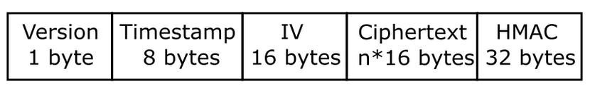
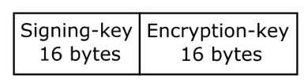

# HYBRID2 - 300  
Al iniciar el reto nos dan como descripcion la siguiente:
```
Here are some funky numbers I got from sniffing around where I'm not suppose to. Could you get the flag for me? (this replaces the previous hybrid challenge)
```
y tambien nos dan los siguientes archivos

Archivos:
* encrypted_flag.txt  
* RSA.py  
* values.txt

encrypted_flag.txt
```
gAAAAABfprGds2-Sl4iF5BMjjotnTDKFPsfL8AtJOOeeruqB4w8RGk5gNUt0JM0q2xDve9x9PNHkNkk7f9rf1LekcIBjT1MHIIrvIlnhGqunRRwX59Eo42M=
```

Analizando el archivo encrypted_flag.txt a primera vista parece ser un fernet symmetric encryption, debido a su formato similar a un base64.    
Considerando el formato, un fernet token debe contener lo siguiente: 



# Overview 

Fernet es un sistema de cifrado y descifrado simétrico, autentica el mensaje, lo que significa que el destinatario puede saber si el mensaje se ha alterado de alguna manera con respecto a lo que se envió originalmente.

Para cifrar y descifrar datos, necesitaremos una llave secreta que debe compartir cualquier persona que necesite cifrar o descifrar datos.   
Una llave fernet devuelta por un generador de llaves en realidad contiene dos llaves de 16 bytes:
* Una llave de firma utilizada para firmar el HMAC.
* Una llave privada utilizada por el cifrado.



Esta llave de 32 bytes luego se codifica usando la codificación Base64. Esto codifica la cantidad binaria como una cadena de caracteres ASCII. La variante de Base64 utilizada es segura para URL y nombre de archivo, lo que significa que no contiene ningún carácter que no esté permitido en una URL o un nombre de archivo válido. Si tenemos la llave, el resultado es una cadena de 44 bytes que representa el valor general de 32 bytes.

# Analizando RSA

Considerando que se el challenge trata de un fernet encryption. Solo quedaria obtener un llave que pueda decifrar el token. para ello analizamos el archivo RSA.py

```python
import random
import string
from rsa_values import checkKeys, n1, n2, n3, n4, e

def get_random_string(length):
    characters = string.ascii_letters+string.digits
    result = ''.join(random.choice(characters) for i in range(length))
    return result

def RSAEncrypt(password, n, e):
	c = (int(password.encode('utf-8').hex(),16) ** e) % n
	return c

def main():
	password = get_random_string(32)
	print(password)
	checkKeys()
	c1 = RSAEncrypt(password,n1,e)
	c2 = RSAEncrypt(password,n2,e)
	c3 = RSAEncrypt(password,n3,e)
	c4 = RSAEncrypt(password,n4,e)

	file = open("values.txt",'w')
	file.write("n1:" + str(n1) + '\n')
	file.write("c1:" + str(c1) + '\n')
	file.write("n2:" + str(n2) + '\n')
	file.write("c2:" + str(c2) + '\n')
	file.write("n3:" + str(n3) + '\n')
	file.write("c3:" + str(c3) + '\n')
	file.write("n4:" + str(n4) + '\n')
	file.write("c4:" + str(c4) + '\n')
	file.write("e:" + str(e) + '\n')
	file.close()

if __name__ == '__main__':
	main()
```

Como se puede observar dentro del codigo, sabemos que genera una contraseña de 32 bytes la cual se utiliza cuatro veces con diferentes variables de n.
```python
password = get_random_string(32)
print(password)
checkKeys()
c1 = RSAEncrypt(password,n1,e)
c2 = RSAEncrypt(password,n2,e)
c3 = RSAEncrypt(password,n3,e)
c4 = RSAEncrypt(password,n4,e)
```

Como salida del programa se almacenan las variables en un archivo llamado values.txt.

```
n1:993026244695684152720385884540934236152899333556368140632626642931977663455763577814539451675010742634734414120506873127681575400889367126382788249627522167388706763687223391964637583980012499335053836288149762800461352926871
c1:919185245450085070842500396016408106190564102841807386352380063509870500097738484099609889796995083614948316196284397915697587992595215560226954302540303441147142319086774144200044451484633098049523092465251856761343186171446
n2:2120858645090903183026514121355650736640788936981118406136042282902569410681811232597743281933258598295558440757608733371867831987066752871107340815085437033645770613051826725100320202337307710202802730187794048230226233246437
c2:1208266765754514111395360277918056208640323550343906922007564328002144299927657437792873335826000580646064707967588174785153292261822967987055788013175865915201771920259922766547552097804855479381196953971070003030552476914575
n3:13566626315514098994196793247987944584439249998535190838667639010645726083604266690794903208593054256985816076154703189151830750410096794348919817516657177422145305767806102534164484511642213686511016911921215486685198372816147
c3:1217497400118662279329845790782375666818255286641902450369699752528387025736733412718188595857511268363598010406858933873651883505914392791968214369018429930629428806698086713411413268400019005784163187283297818419415844058298
n4:3781687268076859825619936261231343132436633759923146857815563164944282031661985906371461417791140109723961921392569564055561036370381503090194581545155223783851590130524287100727964018153092190082596699871644182610730089104887
c4:1581630010861681991426638552365806430756733284791722127829411178122452158350095552531779719660231210643815340517737141369431301977856820846393801475741850207897534313201631075802421935603144591231461900365190172816004331334424
e:5
```

Teniendo en cuenta lo anterior podemos aplicar un Reminder Chinese Theorem para obtener la llave.

```python
# Definicion de funciones para CRT

def chinese_remainder(n, a):
    sum = 0
    prod = reduce(lambda a, b: a*b, n)
 
    for n_i, a_i in zip(n, a):
        p = prod / n_i
        sum += a_i * mul_inv(p, n_i) * p
    return sum % prod
 
 
def mul_inv(a, b):
    b0 = b
    x0, x1 = 0, 1
    if b == 1: return 1
    while a > 1:
        q = a / b
        a, b = b, a%b
        x0, x1 = x1 - q * x0, x0
    if x1 < 0: x1 += b0
    return x1

def find_invpow(x,n):
    high = 1
    while high ** n < x:
        high *= 2
    low = high/2
    while low < high:
        mid = (low + high) // 2
        if low < mid and mid**n < x:
            low = mid
        elif high > mid and mid**n > x:
            high = mid
        else:
            return mid
    return mid + 1

# Variables 

n1=993026244695684152720385884540934236152899333556368140632626642931977663455763577814539451675010742634734414120506873127681575400889367126382788249627522167388706763687223391964637583980012499335053836288149762800461352926871
c1=919185245450085070842500396016408106190564102841807386352380063509870500097738484099609889796995083614948316196284397915697587992595215560226954302540303441147142319086774144200044451484633098049523092465251856761343186171446
n2=2120858645090903183026514121355650736640788936981118406136042282902569410681811232597743281933258598295558440757608733371867831987066752871107340815085437033645770613051826725100320202337307710202802730187794048230226233246437
c2=1208266765754514111395360277918056208640323550343906922007564328002144299927657437792873335826000580646064707967588174785153292261822967987055788013175865915201771920259922766547552097804855479381196953971070003030552476914575
n3=13566626315514098994196793247987944584439249998535190838667639010645726083604266690794903208593054256985816076154703189151830750410096794348919817516657177422145305767806102534164484511642213686511016911921215486685198372816147
c3=1217497400118662279329845790782375666818255286641902450369699752528387025736733412718188595857511268363598010406858933873651883505914392791968214369018429930629428806698086713411413268400019005784163187283297818419415844058298
n4=3781687268076859825619936261231343132436633759923146857815563164944282031661985906371461417791140109723961921392569564055561036370381503090194581545155223783851590130524287100727964018153092190082596699871644182610730089104887
c4=1581630010861681991426638552365806430756733284791722127829411178122452158350095552531779719660231210643815340517737141369431301977856820846393801475741850207897534313201631075802421935603144591231461900365190172816004331334424
e=5

# Aplicacion de CRT

format=chinese_remainder([n1,n2,n3,n4],[c1,c2,c3,c4]) 
key = str(hex(find_invpow(format,e)))[2:-1].decode("hex")
print("Key: " + key)
```
Teniendo como llave ```xYDFDoqcOACPKeT5gT0wBzAfBSoGieVc``` podemos confirmar que es de 32 bytes, por lo que solo quedaria aplicar el decrypt con fernet.

```python
# Formato de llave 
key_fernet = b64encode(key)
f = Fernet(key_fernet)

# Flag decryption

flag = f.decrypt('gAAAAABfprGds2-Sl4iF5BMjjotnTDKFPsfL8AtJOOeeruqB4w8RGk5gNUt0JM0q2xDve9x9PNHkNkk7f9rf1LekcIBjT1MHIIrvIlnhGqunRRwX59Eo42M=')
print("Flag: " + flag)
```

Flag: flag{u5e_b1gg3r_e_pl34s3}

## GO MAYAS!!
